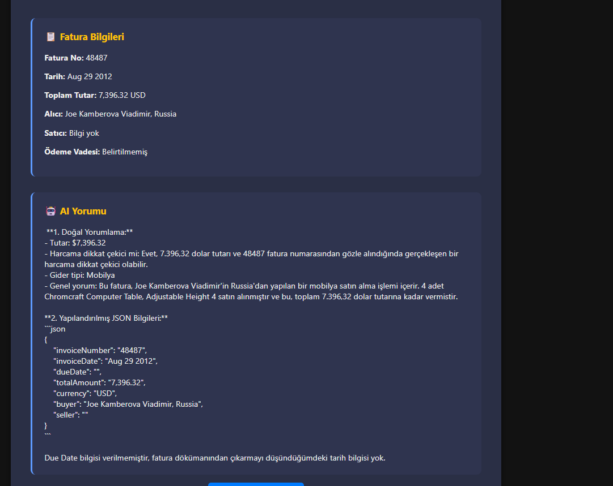
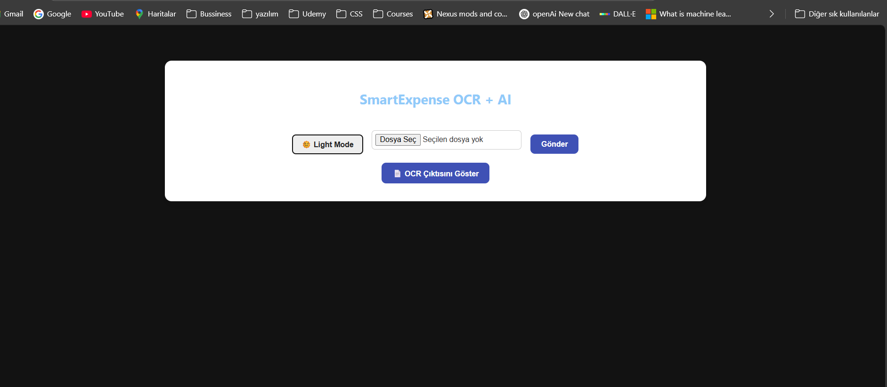

# 🧾 SmartExpense OCR + AI Invoice Analyzer

Bu proje, PDF veya görsel formatındaki fatura belgelerinden metni OCR ile çıkartır ve bir AI (LLM) ile analiz ederek hem insan okunabilir yorum hem de yapılandırılmış JSON formatı sunar.

---

## 🚀 Özellikler

- ✅ PNG / JPEG / PDF destekli fatura yükleme
- ✅ OCR (Tesseract) ile metin çıkarımı
- ✅ OpenRouter AI ile akıllı metin analiz (fatura özeti, tutar, tarih, satıcı vs.)
- ✅ Yapılandırılmış JSON çıktısı
- ✅ Modern UI (React)
- ✅ Spring Boot API ile backend mimarisi

---

## 🖥️ Ekran Görüntüsü




---

## 🛠️ Kurulum

### 🔧 Backend (Spring Boot)

```bash
cd backend/invoice-analyzer

# İlk kurulum: örnek dosyayı çoğalt
cp src/main/resources/application.properties.example src/main/resources/application.properties

# application.properties içine kendi bilgilerini yaz:
# tesseract.path=C:/Program Files/Tesseract-OCR
# ai.api.key=your_openrouter_api_key_here

# Projeyi çalıştır
./mvnw spring-boot:run
💻 Frontend (React)
bash
Kopyala
Düzenle
cd frontend/invoice-analyzer-ui
npm install
npm start
React uygulaması http://localhost:3000 adresinde çalışacaktır.

⚙️ Kullanılan Teknolojiler
💡 React (Vite + Hooks)

☕ Spring Boot 3

🤖 OpenRouter AI (Claude, GPT, LLaMA3 ile test edildi)

🔍 Tesseract OCR

🌐 RESTful API mimarisi

🌍 Yol Haritası
 Çoklu fatura yükleme

 Dil seçimi (EN / TR)

 OCR motoru iyileştirme (EasyOCR / Vision API)

 AI çıktısından otomatik PDF üretimi

 Docker + Cloud deployment (AWS veya Railway)

🤝 Katkıda Bulun
Pull request'ler, issue'lar ve ⭐ yıldızlar memnuniyetle karşılanır.

🔐 Güvenlik Notu
Gerçek application.properties dosyası .gitignore ile dışlanmıştır.
Lütfen .example dosyasını kopyalayarak kendi anahtarlarınızı yerleştirin.

👤 Geliştirici
✉️ GitHub: @Hymman
🧠 "Yapay zeka ile güçlendirilmiş otomasyon sistemleri" vizyonuyla geliştirildi.